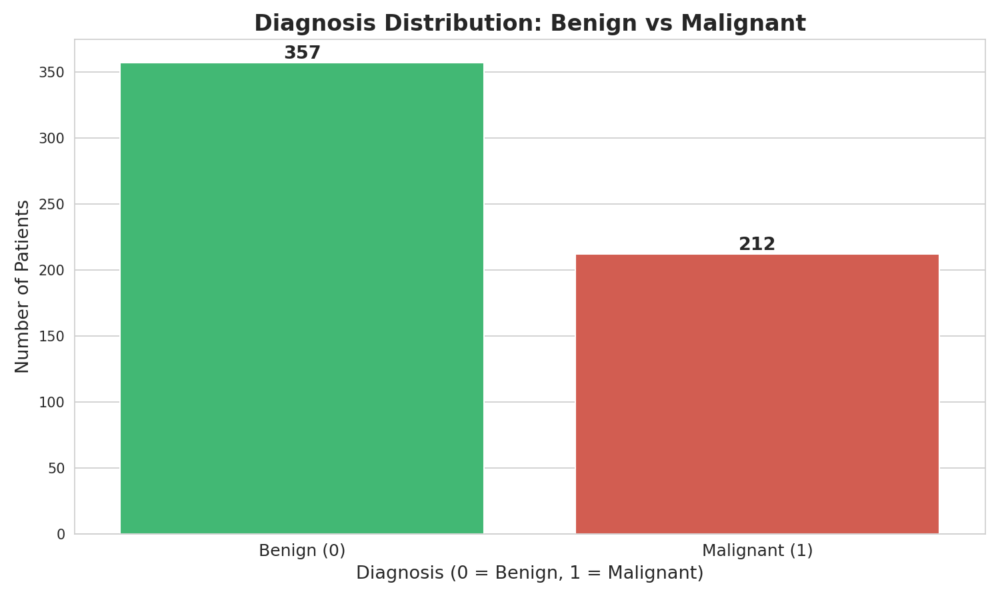
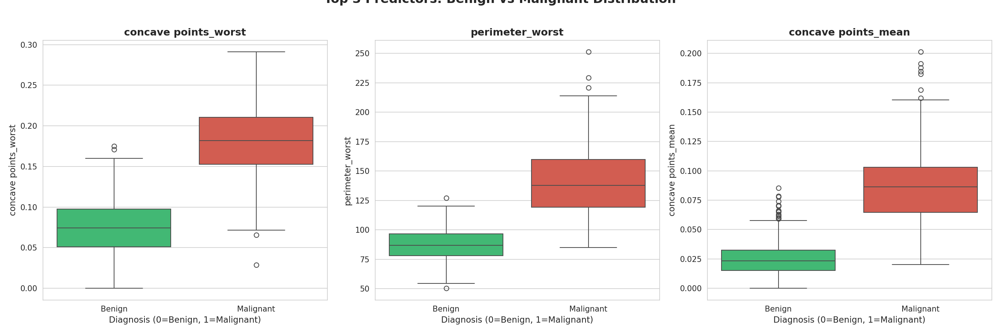
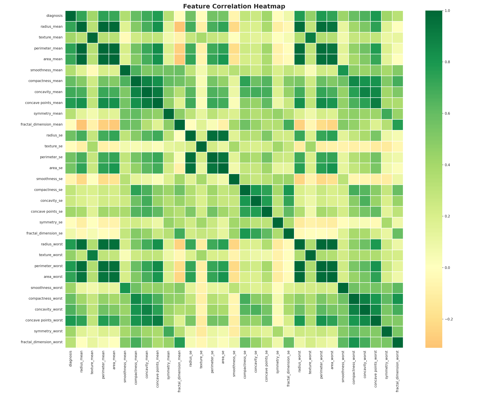
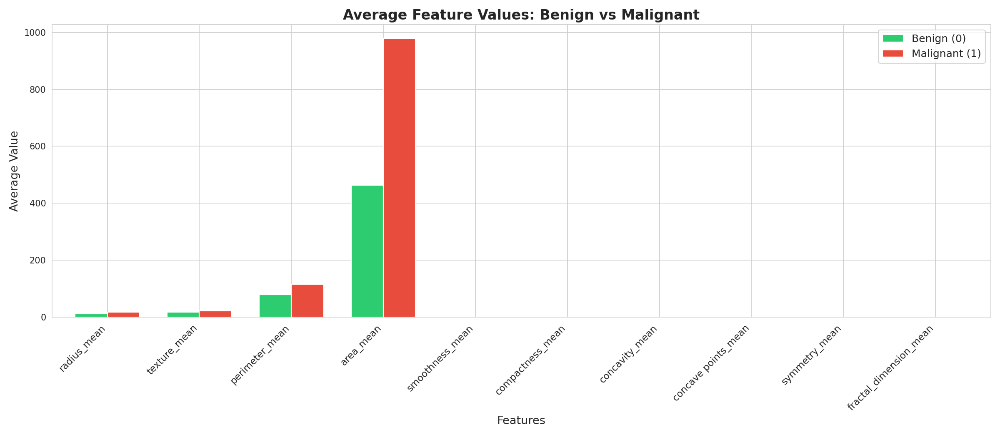
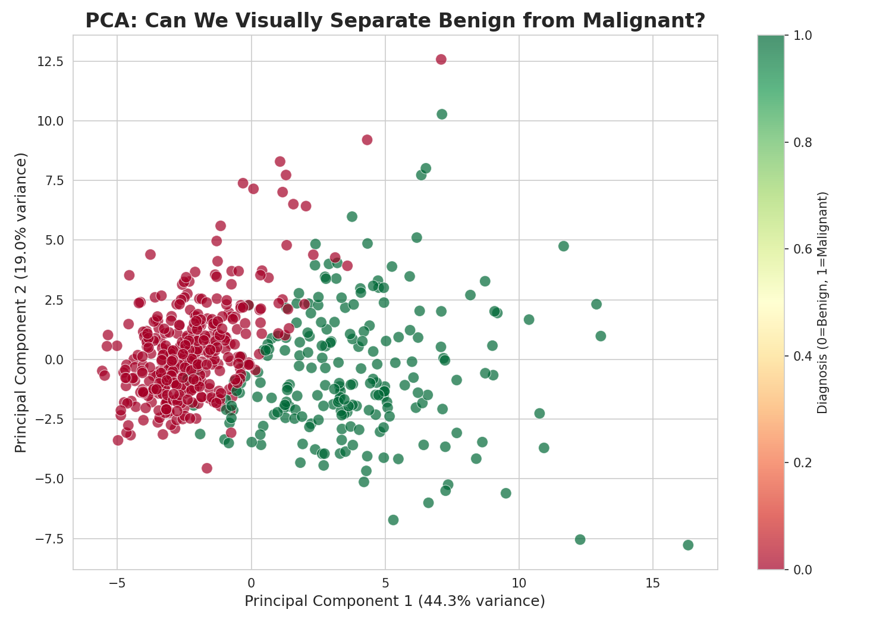
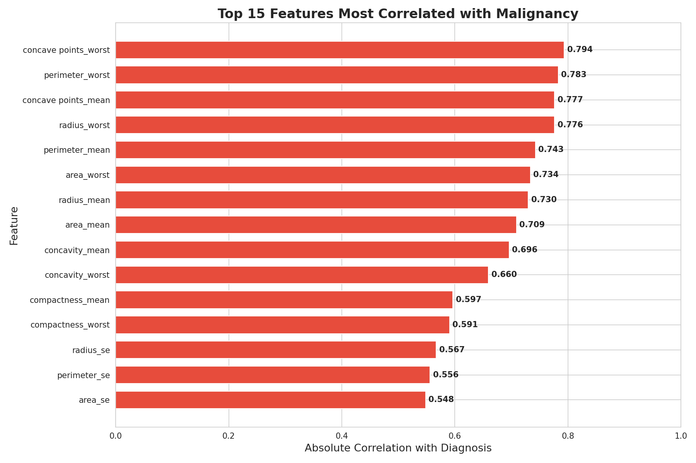
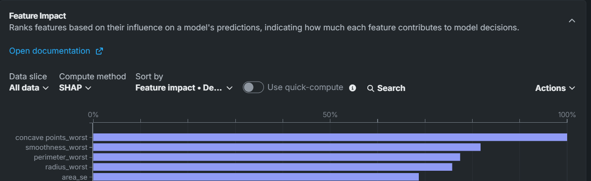
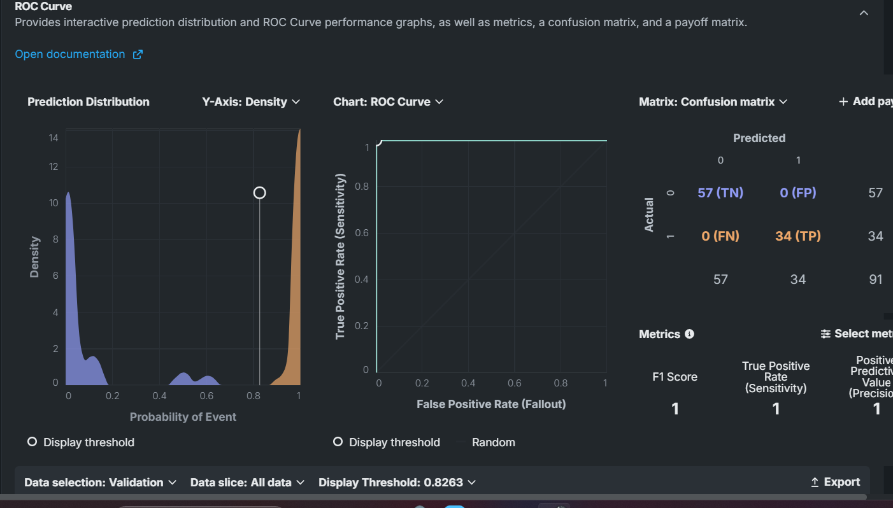
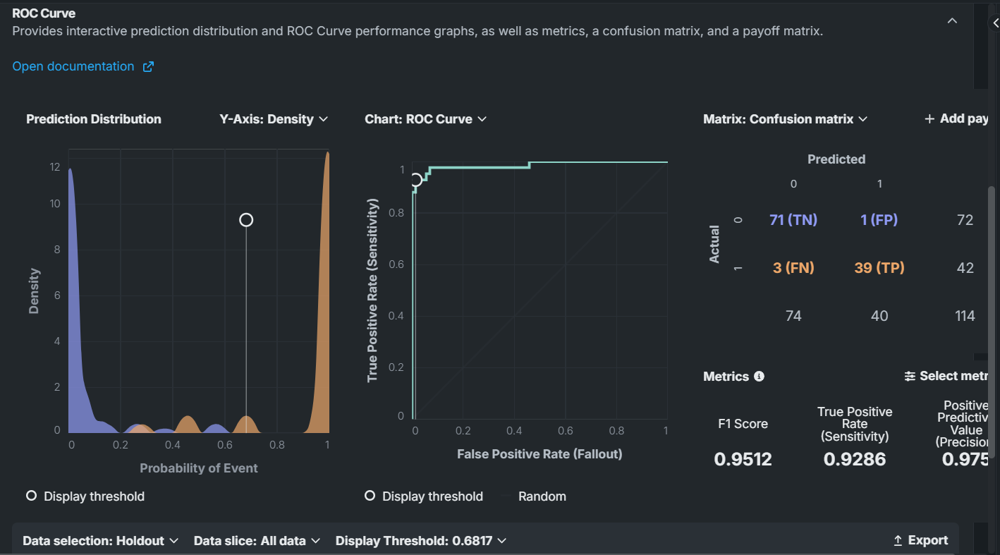
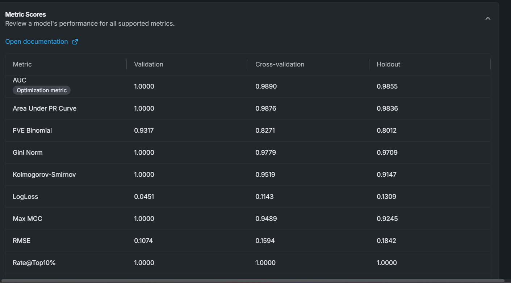

[README.md](https://github.com/user-attachments/files/28919383/README.md)
# Breast Cancer Diagnostic Predictor

I built this project because I wanted to work on something that actually matters. Predicting whether a tumour is malignant or benign from biopsy measurements isn't a new problem — but most people who tackle it stop at printing an accuracy score and calling it done. I wanted to go further and ask: what does a wrong prediction actually cost? Not in model metrics, but in human terms.

The dataset comes from real Fine Needle Aspirate biopsies performed at the University of Wisconsin Hospital. 569 patients. 30 measurements per patient. One question: malignant or benign?

---

## What I Built

An end-to-end diagnostic support pipeline covering data cleaning, exploratory analysis, model training, clinical impact quantification, and visualization — across Python, DataRobot, Excel, and Tableau.

The model ended up with a **0.9855 AUC on completely unseen patients**, catching 39 of 42 malignant cases. More importantly, it caught **23 cancers that a random baseline would have missed** — and I quantified what those missed cases would have cost in treatment dollars and survival probability.

---

## The Tools

| Phase | Tool |

| Cleaning & EDA | Python (Google Colab) |
| Model Training | DataRobot AutoML |
| Clinical Impact | Microsoft Excel |
| Visualization | Tableau |

---

## Phase 1 — Cleaning

Nothing dramatic here. The dataset is clean by design — no missing values, no duplicates. The main tasks were dropping two useless columns (`id` and an empty `Unnamed: 32` ghost column), encoding the target variable (M → 1, B → 0), and confirming that the high values in `area_worst` and `perimeter_worst` weren't data errors — they're clinically real. Malignant cells genuinely are that much larger.

**Output:** 569 rows × 31 columns, zero nulls, ready for analysis.

---

## Phase 2 — Exploratory Analysis

Before touching a model, I wanted to understand what separates a malignant tumour from a benign one in this data. A few things stood out immediately.

### The class split matters more than it looks



62.7% of cases are benign, 37.3% malignant. That sounds balanced enough — but it means a model that predicts "benign" for every single patient would score 62.7% accuracy while missing every cancer in the dataset. Accuracy is the wrong metric here. Recall is what matters.

### The top predictors all measure the same two things



The three features most correlated with malignancy are `concave points_worst`, `perimeter_worst`, and `concave points_mean`. All three measure either cell size or shape irregularity. Malignant cells are bigger and spikier. That's what the model is learning — and it's consistent with how pathologists diagnose cancer manually.

### Many features are measuring the same thing



`radius_mean`, `perimeter_mean`, and `area_mean` are all essentially measuring cell size from different angles. The correlation between them is almost perfect. This multicollinearity doesn't break the model, but it's worth knowing — and DataRobot's feature selection handles it automatically.

### Cell size is the most visible difference



When you average feature values by diagnosis, `area_mean` shows the largest gap between the two groups. Malignant tumours have roughly twice the average cell area of benign ones.

### The two classes are genuinely separable



Compressing all 30 features down to 2 dimensions (capturing 63.3% of total variance), the benign and malignant cases still form distinct clusters. There's overlap in the middle — that's where the hard cases live — but the separation is strong enough to explain why the model performs so well.

### The feature ranking



Top 5 by correlation with diagnosis: `concave points_worst` (0.794), `perimeter_worst` (0.783), `concave points_mean` (0.777), `radius_worst` (0.776), `perimeter_mean` (0.742). Every single one measures size or shape irregularity.

---

## Phase 3 — Model Training (DataRobot)

I used DataRobot's AutoML to train and compare multiple model types simultaneously. One deliberate choice: I optimized for **AUC instead of accuracy**. For an imbalanced medical classification problem, AUC measures how well the model separates the two classes across all possible thresholds — which is the right question to ask.

**Configuration:**
- Target: `diagnosis` (binary classification, positive class = 1/Malignant)
- Optimization metric: AUC
- Validation: 64% training / 16% validation / 20% holdout
- Sampling: Stratified

### Why I picked XGBoost over the neural network

The Keras neural network had a slightly higher cross-validation AUC, but XGBoost generalized more consistently to the holdout set. More importantly, XGBoost produces interpretable feature importance scores. In a clinical context, a model needs to explain *why* it flagged a patient — not just *that* it did. A black-box neural network fails that test.

### What the model learned



DataRobot's SHAP-based feature importance confirmed 3 of the 5 predictors I identified manually in EDA: `concave points_worst`, `perimeter_worst`, and `radius_worst`. It also surfaced `smoothness_worst` and `area_se` — adding a third dimension to the clinical story. Malignant cells aren't just larger and more irregular — they're also more variable in surface texture and area across the tumour sample.

### Performance on validation data



On the validation set, the model achieved a perfect confusion matrix — zero false negatives, zero false positives. This is the in-sample result, so it needs to be taken with appropriate skepticism.

### Performance on the holdout set (the honest number)



On 114 completely unseen patients:

| Metric | Score |
|---|---|
| AUC | 0.9855 |
| F1 Score | 0.9512 |
| Recall / Sensitivity | 0.9286 |
| Precision | 0.9750 |

The model correctly identified 39 of 42 malignant cases and flagged only 1 benign case incorrectly. Three malignant cases were missed.

### Full metric breakdown



The Rate@Top10% score of 1.000 is worth highlighting: every malignant case in the holdout set appears in the top 10% of highest-risk predictions. A hospital screening only the top 10% of flagged patients would catch every cancer.

### On the 3 missed cases

Missing 3 out of 42 malignant cases isn't a model failure — it's a threshold decision. At the default 0.5 threshold, the model is balanced between precision and recall. Lowering the threshold to 0.3 would catch more cancers at the cost of more false alarms. That trade-off is a clinical judgment, not a technical one. The model should surface the risk score; a clinician should decide what to do with it.

---

## Phase 4 — Clinical Impact (Excel)

Model metrics are useful for comparing algorithms. They're not useful for explaining to a hospital administrator why they should change their diagnostic process. So I translated the results into terms that matter.

**The comparison that tells the story:**

| Scenario | Cancers Caught | Cancers Missed | Est. Treatment Cost |
|---|---|---|---|
| No model (baseline) | 16 | 26 | $3,380,000 |
| XGBoost model | 39 | 3 | $390,000 |
| Perfect model | 42 | 0 | $0 |

The cost figures are based on the well-documented gap between early-stage (~$20K) and late-stage (~$150K) breast cancer treatment costs. A missed diagnosis doesn't just cost a life — it costs $130,000 more to treat when the cancer is eventually found at a later stage.

**The numbers:**
- 23 additional cancers caught vs. unassisted baseline
- $2,990,000 in avoidable treatment costs prevented on the holdout set alone
- Each missed malignancy carries a 72% reduction in 5-year survival probability (99% early-stage vs. 27% late-stage)

---

## Phase 5 — Tableau Visualizations

Three analytical views built from the patient-level dataset rather than summary tables:

**Scatter plot** — Each dot is a real patient, colored by diagnosis, plotted on the two strongest predictors. The natural separation between the green (benign) and red (malignant) clusters visually explains why the model works.

**Box plots** — Side-by-side distribution comparison across the top 6 predictors. Malignant cases sit higher and spread wider on every feature. Texture mean shows the least separation — confirming it's the weakest of the six.

**Heatmap** — All 30 features normalized to 0–1 and compared by diagnosis. The contrast between benign and malignant is strongest for `area_worst` (average 559 vs. 1,422 — a 2.5x difference) and weakest for `fractal_dimension_se` (essentially identical between groups).

---

## Files

```
breast_cancer_phase1_cleaning.ipynb   — cleaning notebook
breast_cancer_phase2_EDA.ipynb        — EDA notebook with all 6 charts
breast_cancer_clean.csv               — cleaned dataset
breast_cancer_dataset.csv             — original Kaggle download
breast_cancer_phase4_clinical_impact.xlsx  — clinical impact workbook
chart1 through chart10                — all visualizations
```

---

## Key Takeaways

Accuracy is the wrong metric for medical diagnosis. The model's 62.7% baseline accuracy is meaningless — what matters is whether it catches cancers, and how many it misses.

The biology is consistent throughout. Every analysis — manual correlation, PCA, SHAP importance — points to the same two properties: cell size and shape irregularity. The model isn't doing anything mysterious. It's quantifying what pathologists already look for.

Threshold matters more than algorithm choice. The gap between catching 39 and 42 malignant cases isn't about picking a better model — it's about where you set the decision boundary. That's a clinical question, not a data science one.

Clinical impact has to be quantified in human terms. AUC of 0.9855 means nothing to a hospital administrator. "23 additional cancers caught" and "$2.99M in preventable costs" do.

---

**Muzammil Ansari**  
Post-Baccalaureate Diploma in Business Analytics — University of the Fraser Valley  
[LinkedIn](https://linkedin.com/in/muzammilansari7494) | Abbotsford, BC

*Dataset: UCI Breast Cancer Wisconsin (Diagnostic). This project is for portfolio and educational purposes only and is not intended for clinical use.*
